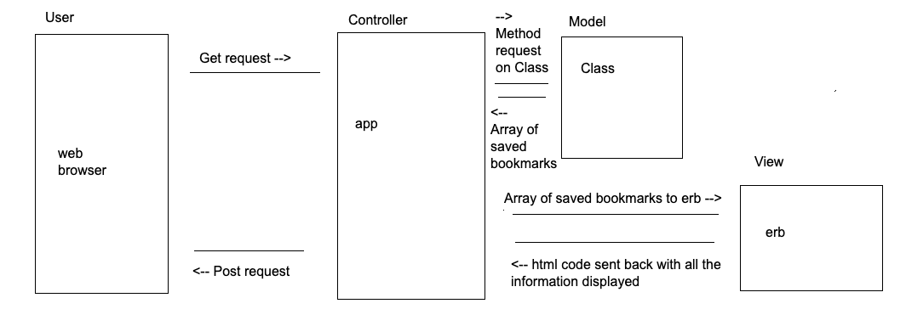

## Bookmark-Manager

# User Stories:

User Story 1:

As a frequent user of the Internet
So I can visit my favourite websites quickly
I want to see a list of bookmarks

Setting up the database:
1. connect to psql
2. create the database using the command CREATE DATABASE bookmark_manager;
3. connect to the database with \c bookmark_manager
4. run the query saved in the file 01_create_bookmarks_table.sql